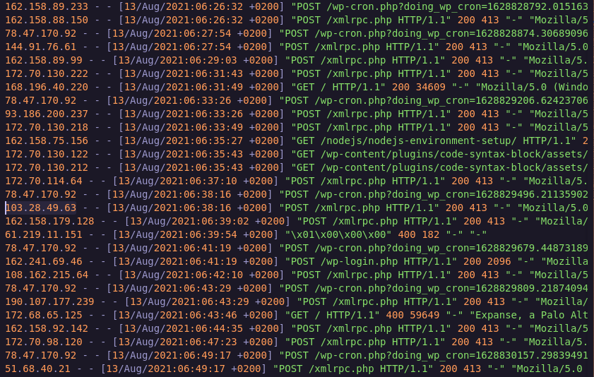
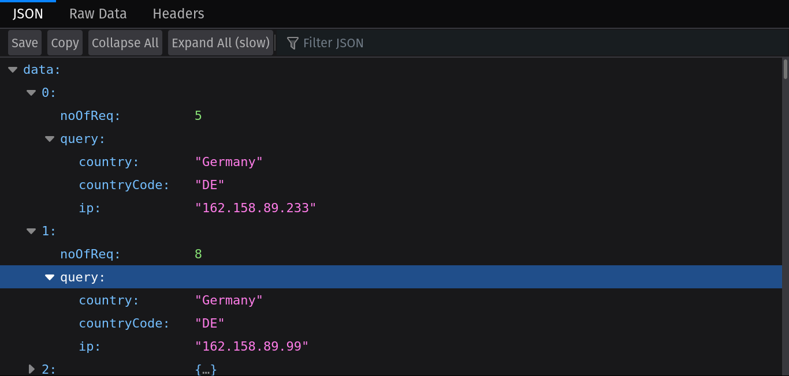
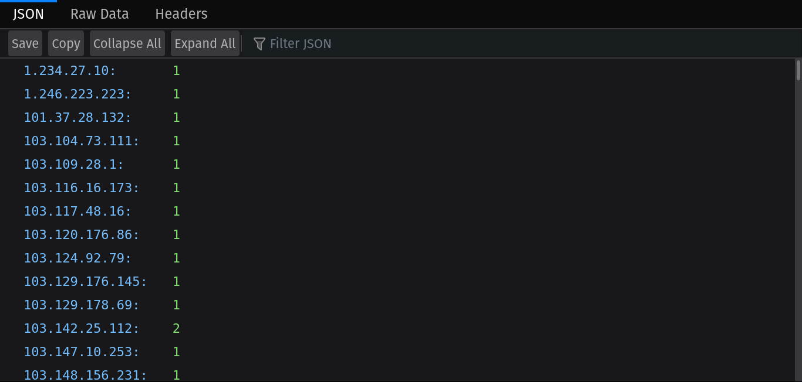
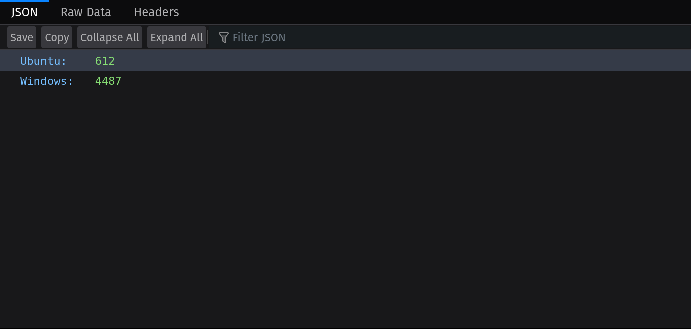
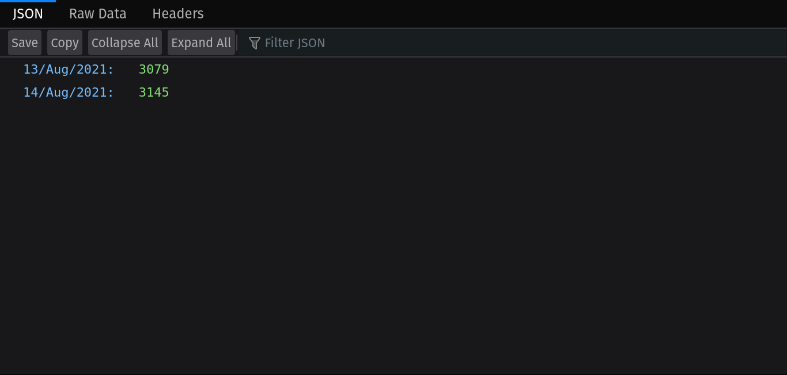

## Log parser

> The project uses **Python** and parses the given log file using **regex**.  
> It uses **node js** to make asyncronous calls to a third party api to convert the IP addresses into geolocation data.  
> **Flask** is used to create a rest api to serve the parsed data.

The given file 

### Parsing by geolocation

### Parsing by ip

### Parsing by os

### Parsing by date time

